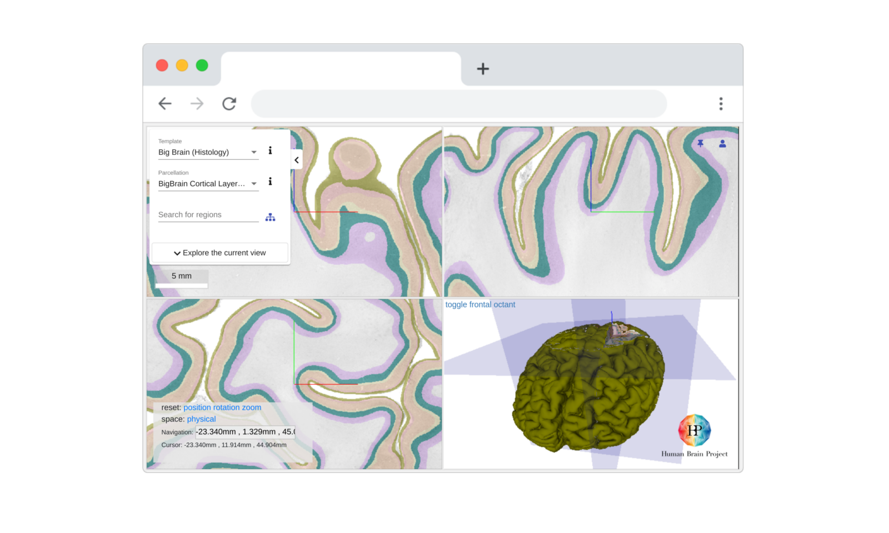

# Interactive Atlas Viewer

Interactive Atlas Viewer is a browser based viewer of brain atlases. Strong integration with the Human Brain Project Knowledge Graph project allow data/datasets that are semantically and spatially anchored to be easily accessible with minimal setup required.

## Important links

- production: <https://interactive-viewer.apps.hbp.eu>
- production: <https://atlases.ebrains.eu/viewer>
- contact us: [inm1-bda@fz-juelich.de](mailto:inm1-bda@fz-juelich.de?subject=[IAV]%20Queries)
