# Exploring connectivity

The interactive atlas viewer allows the exploration of connectivity of parcellation regions, based on datasets curated in HBP Knowledge Graph.

Currently, connectivity data is explorable for the parcellation `JuBrain Cytoarchitectonic Atlas`, which is available in template spaces `MNI Colin 27` and `ICBM 2009c Nonlinear Asymmetric`.

## Getting started

- Select parcellation `JuBrain Cytoarchitectonic Atlas` and click on a region to bring up a context-specific menu

   [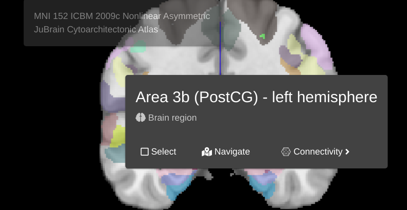](images/region_menu_with_connectivity.png)

- Click the `Connectivity` button, available datasets for connectivity will be displayed

   [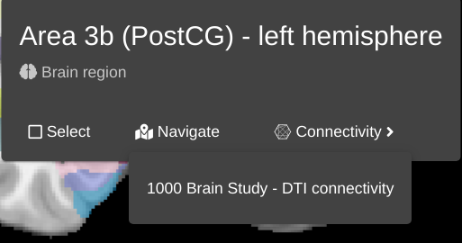](images/connectivity_dataset_menu.png)

- Click on a dataset (e.g. `1000 Brain Study - DTI connectivity`) to explore the connectivity data associated with it.

## Working with connectivity data

Upon selecting a preview dataset, several aspects of the UI will change:

- the color map of the parcellation will be replaced by a heat map, derived from the magnitutde of connectivity.

   | Regular color map | Connectivity heat map |
   | --- | --- |
   | [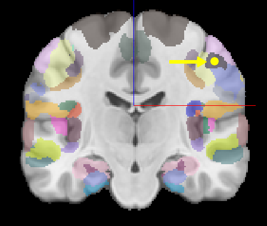](images/connectivity_color_before.png) |  |
    

- a side panel will be opened, showing the tabulated data of the connectivity.

   [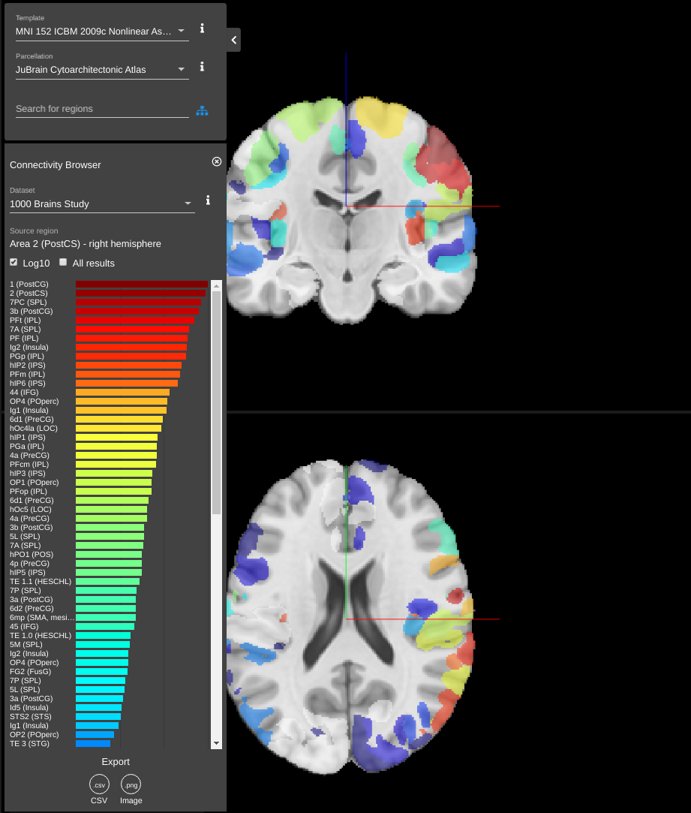](images/connectivity_data_main.png)

### Tabulated side panel

In the tabulated view, the selected dataset can be reviewed and changed.

[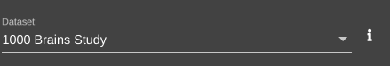](images/see_dataset_connectivity.png)

The source region is displayed in the tabulated view.

[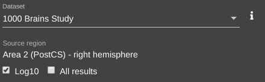](images/connectivity_source_region.png)

The magnitude of the connectivity can either be displayed linearly or logarithmically by toggling the `Log10` checkbox.

| Connectivity plotted logarithmically `default` | Connectivity plotted linearly |
| --- | --- |
| [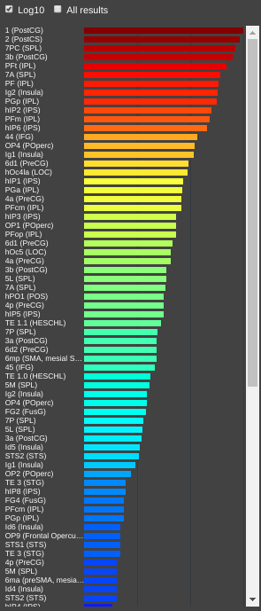](images/con_diagram_log.png) | [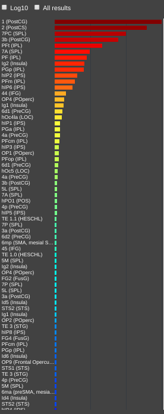](images/con_diagram_no_log.png) |

The display of magnitude of the connectivity can also be toggled with `All results` checkbox.

| Hiding magnitude `default` | Showing magnitude |
| --- | --- |
| [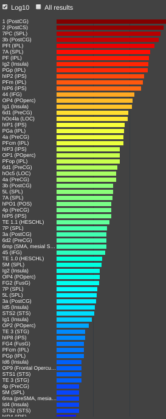](images/conn_disabled_all.png) | [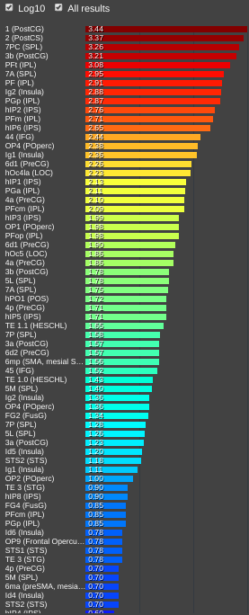](images/conn_enabled_all.png) |

Clicking on any of the connected region will reveal a region context menu. In addition to the full name of the region, two buttons are present:

- `Navigate` - navigate to the region of interest.
- `Connectivity` - to the region of interest as the source, and explore its connectivity with other parcellation regions.

[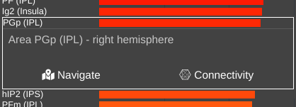](images/conn_expanded_area.png)

### Export

At the bottom of the side panel, `export` buttons can be found. The data can either be exported as a CSV or PNG.

[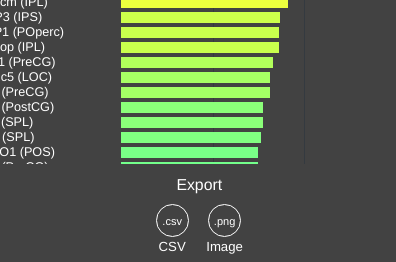](images/conn_export.png)

## Exit

To exit the connectivity mode, click the close button located at the top right side of the side panel.

[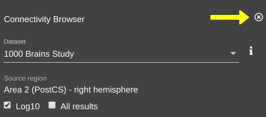](images/close_connectivity.png)

Exiting the connectivity mode will:

- restore the colour map of the parcellation 
- remove the connectivity side panel 
