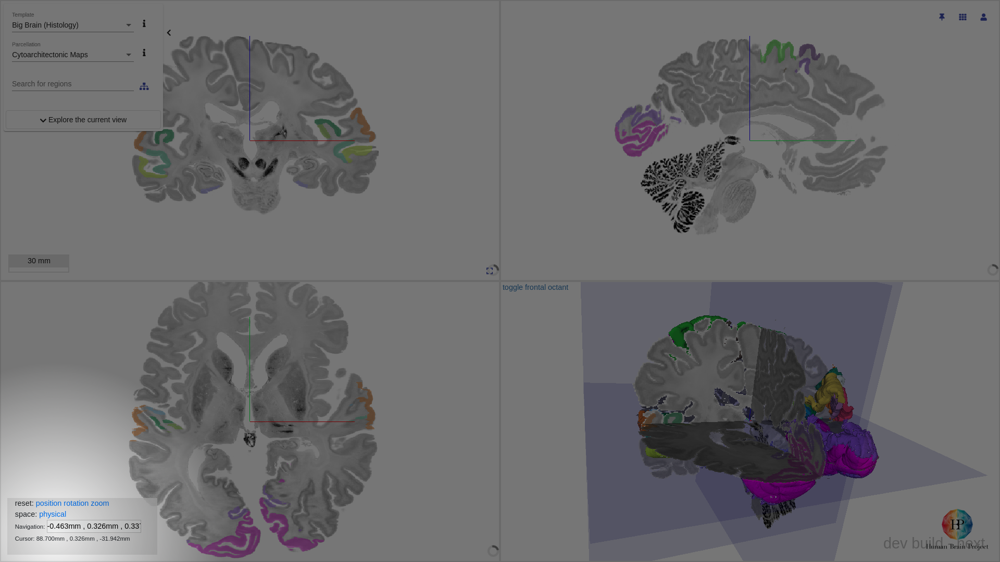

# Navigating

## Navigating the viewer

The interactive atlas viewer can be accessed from either a desktop or an Android mobile device. The navigation scheme vary slightly between the two platforms.

| | Desktop | Mobile |
| --- | --- | --- |
| Translating / Panning | `click drag` on any _slice views_ | `touchmove` on any _slice views_ |
| Oblique rotation | `shift` + `click drag` on any _slice views_ | hold `🌏` + `drag up/down` to switch rotation mode  hold 🌏 + `drag left/right` to rotate |
| Zooming (_slice view_, _3d view_) | `mouse wheel` | `pinch zoom` |
| Next slice (_slice view_) | `ctrl` + `mouse wheel` | |
| Next 10 slice (_slice view_) | `ctrl` + `shift` + `mouse wheel` | |

## Navigating to a region of interest

!!! warning
    Not all regions have a position of interest curated. If absent, the UI elements described below would be missing.
    
    If you believe some regions should have a position of interest curated, or the position of interest was incorrectly curated, please contact us. 

### From the viewer

`click` on a segmented region to bring up a region specific dialog

From here, `click` on `Navigate`.

### From quick search

`click` on the map icon.

### From hierarchy tree

`double click` on the region of interest. 

## Navigation status panel

You can find the navigation status in the lower left corner of the interactive atlas viewer. You can reset the `position`, `rotation` and/or `zoom`, as well as toggling the units between `physical` (mm) and `voxel`.

