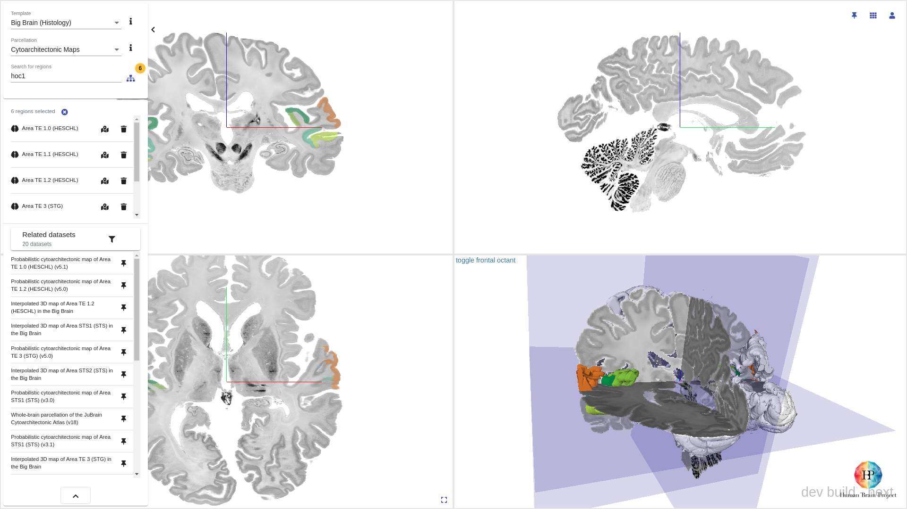
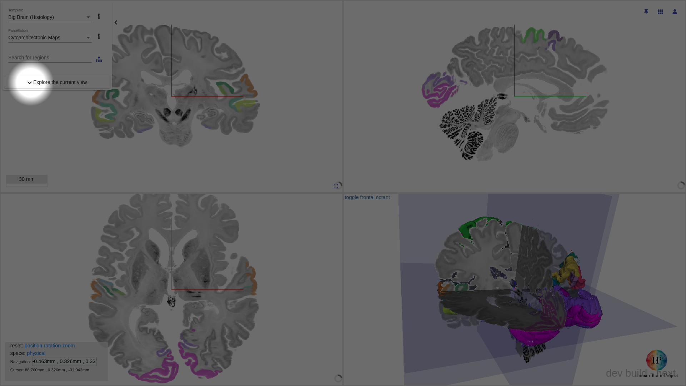
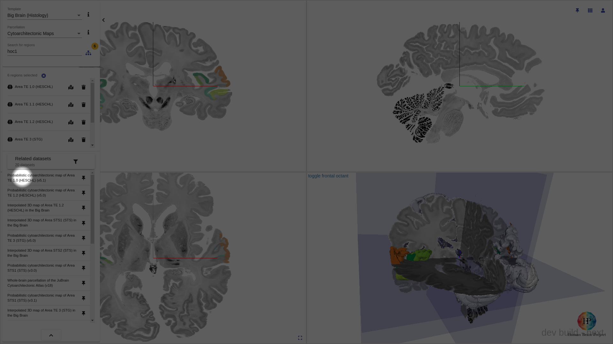
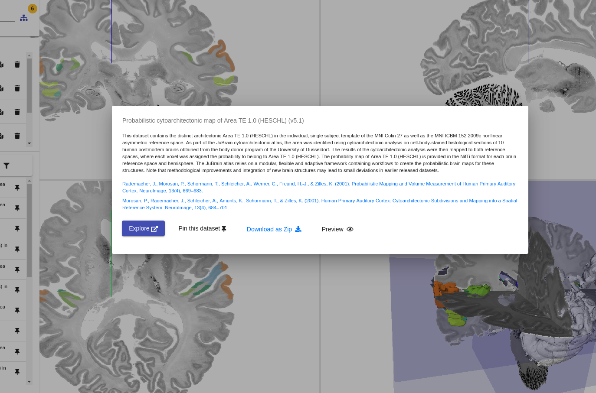
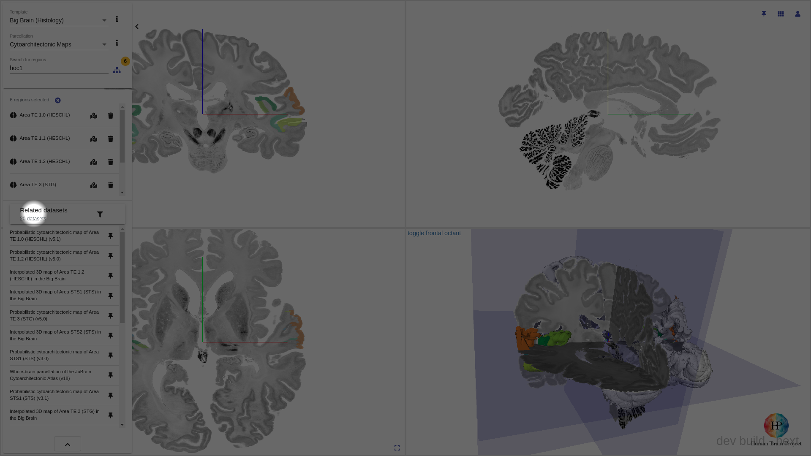
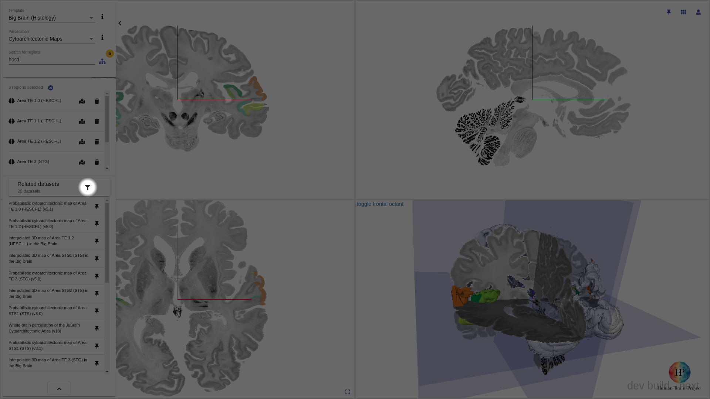

# Searching

Siibra explorer fetches datasets semantically linked to [selected regions](selecting.md#selecting-deselecting-regions). If no regions are selected, all datasets associated with a parcellation will be returned.

## Opening / Closing the search interface

The search interface can be opened by either:

- [selecting any region](selecting.md#selecting-deselecting-regions)
- manually, `click` on `Explore`

The search interface can be closed by clicking the `Collapse` button

## Browsing dataset

`click` on any dataset entry to display a detailed view.

## Filtering search results

You can filter the search result by `click`ing the banner `Related Datasets`. This reveals the filter options. Select/Deselect options to apply the filter.

!!! warning
    Selecting no filter option is not the same as selecting all filter options. 
    
    There may be datasets without any _methods_ curated. These datasets will be shown if no filter is applied (i.e. deselecting all options), but will not show up if all options are selected.

To reset all filters, `click` the `filter icon`

