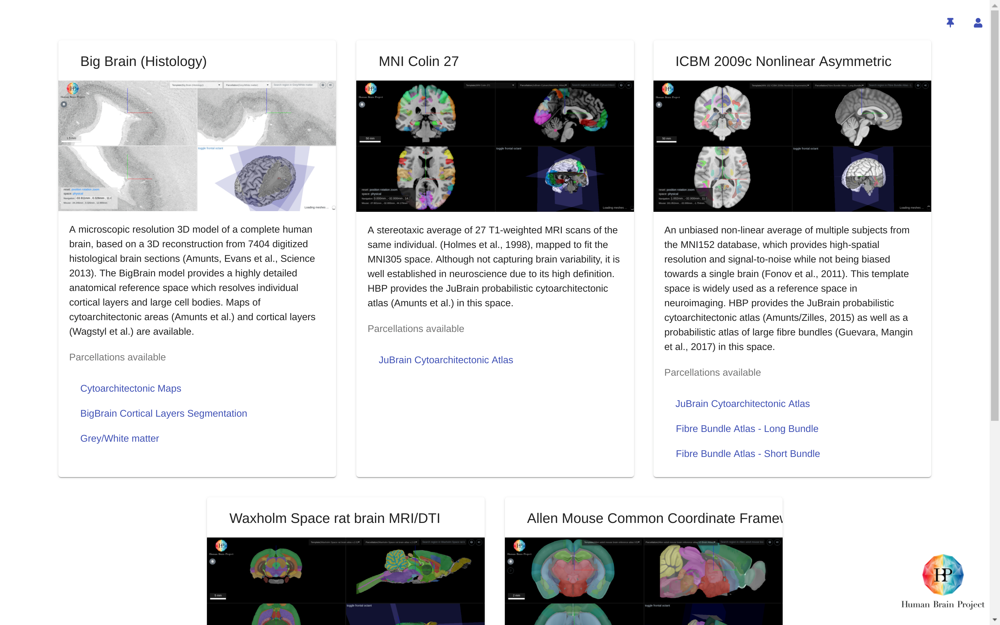
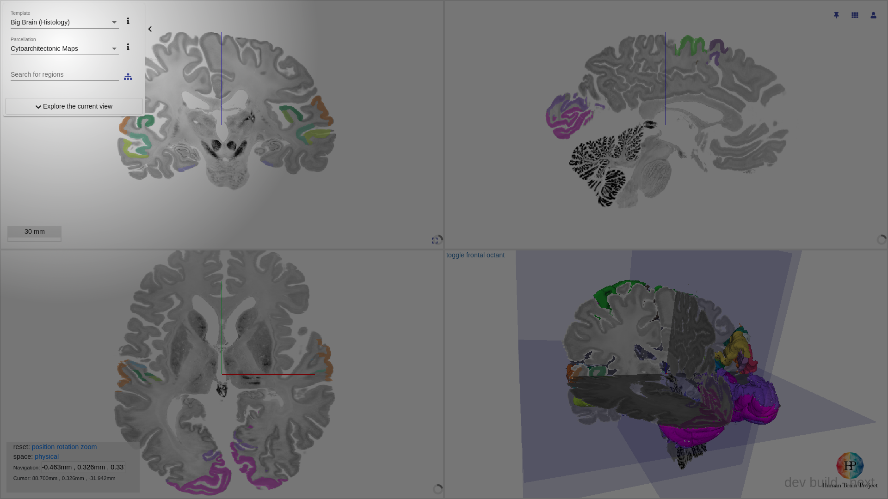
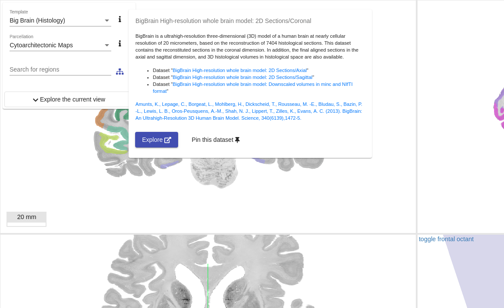
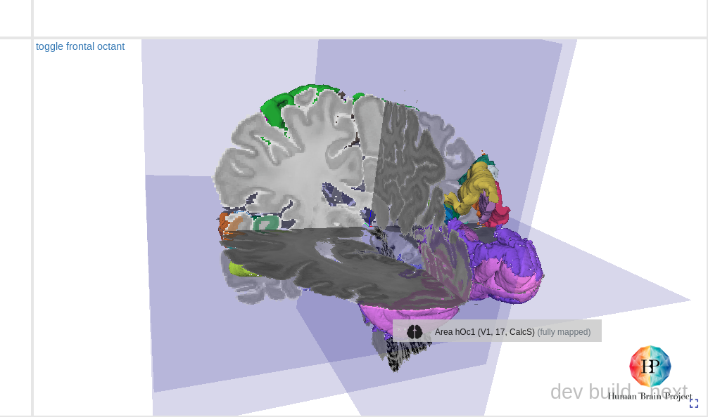
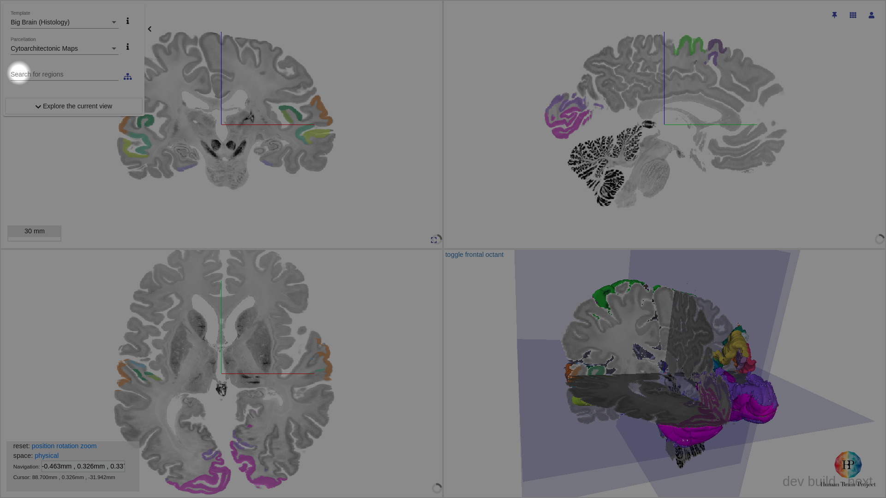
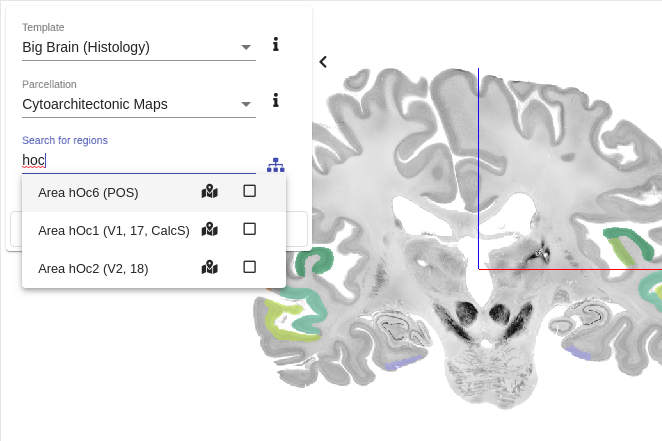
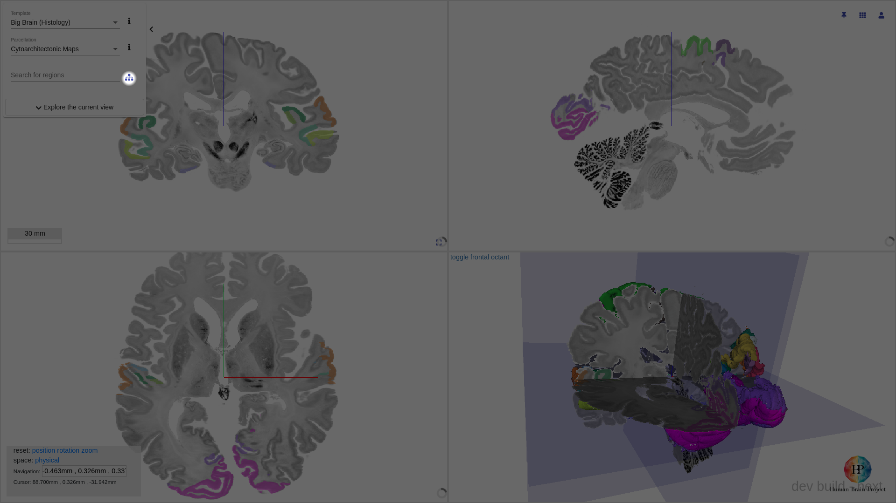
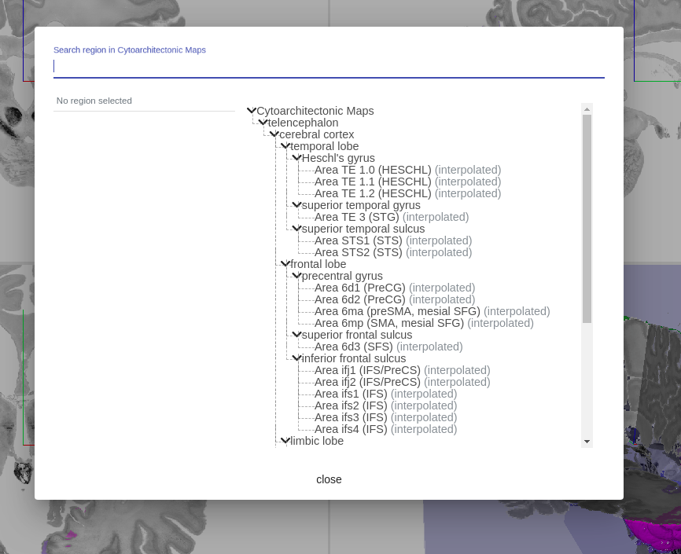
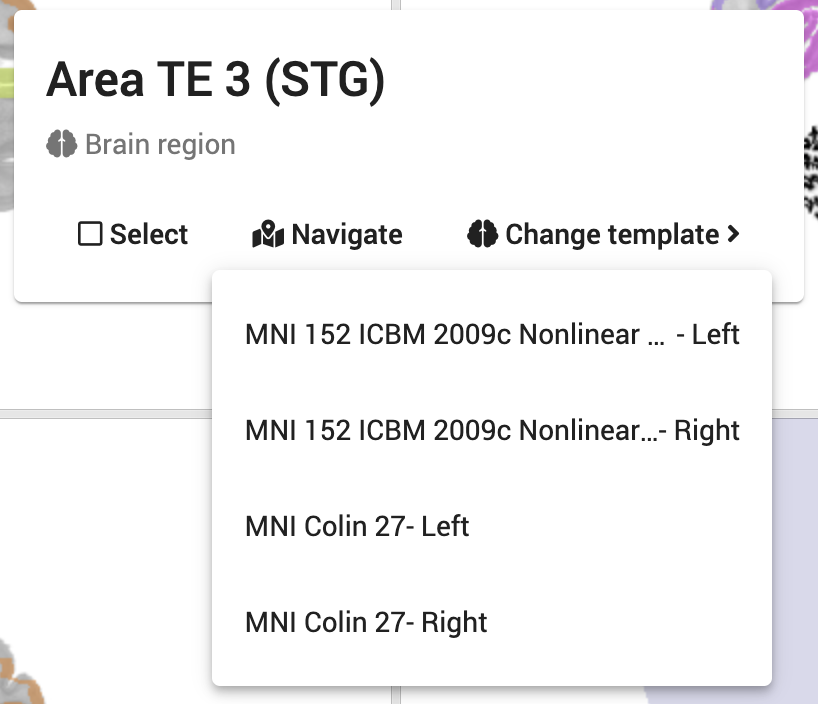
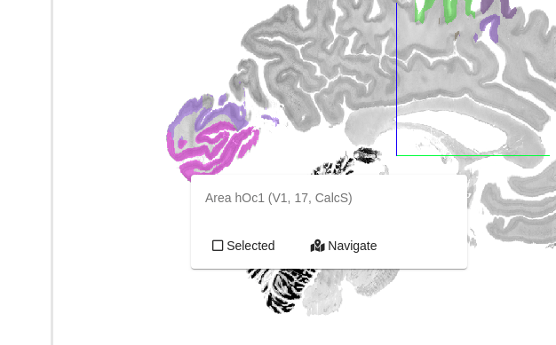

# Selecting

## Selecting a template / atlas

The siibra explorer supports a number of atlases.

### From homepage

On the home page, the atlases are categorised under their respective template spaces.

Select any of the parcellations listed, the siibra explorer will load the parcellation in the corresponding template space.

Clicking on the template card will load the template and the first of the listed parcellation under the template space.

### From viewer

If an atlas is already loaded, the list of available templates and parcellations can be accessed from the side bar.

### Information on the selected template / parcellation

Information on the selected template or parcellation can be revealed by `hovering` or `tapping` the `info` button

## Browsing regions

There exist several ways of browsing the parcellated regions in a selected parcellation in the siibra explorer.

### From the viewer

Each of the region is represented as a coloured segment in _slice views_ (and in most circumstances, in _3d view_ as well). `mouse hover` on the segment will bring up a contextual tooltip, showing the name of the region.

### Using the quick search box

Using the quick search box, regions of interest may be searched using keywords.

### Using the hierarchical tree

To view the full hierarchy, `click` the _hierarchy tree_ button. 

### Explore the region in other reference templates
If the parcellation region is available in multiple reference spaces, it is possible to explore them directly from the region context menu.

Click on a parcellation region (coloured segment) to reveal the region context menu. If the region is available in multiple reference spaces, a `Change template` button will appear. Click on `Change template` button to expand available templates.

In the popout menu, you can jump directly to the region in a different reference template by clicking the corresponding option.

## Selecting / Deselecting region(s)

Region(s) of interest may also be selected, which will [fetch and display](search.md) additional information, such as descriptions and semantically linked datasets, about the region(s).

### From the viewer

`click` on a region (coloured segment) to bring up a context specific menu.

From here, `click` on `[] Selected` checkbox will select or deselect the region.

### From the quick search box

`click` on the name or the checkbox will select or deselect the region.

### From the hierarchical tree

`click` on any _region_ or _parent region_ will (mass) select / deselect the region(s). 

