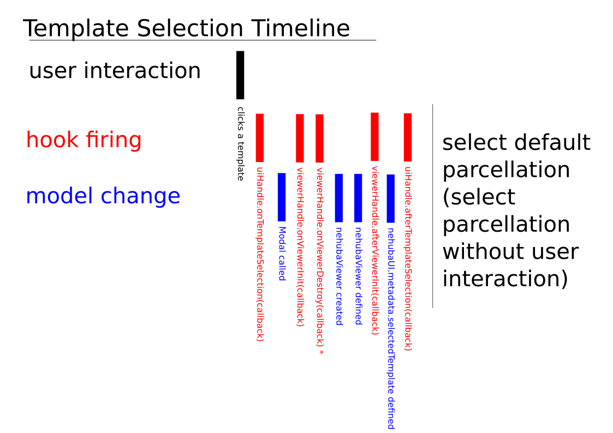
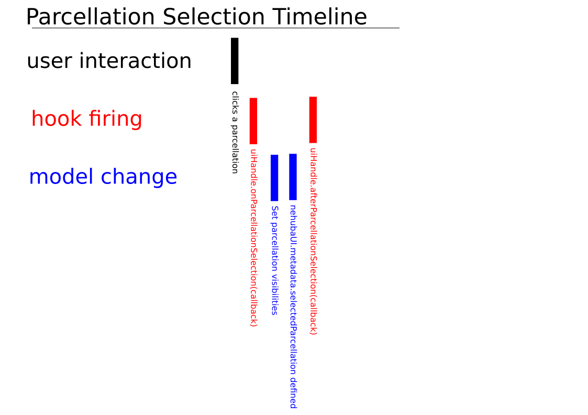

Plugin APIs
======

- *window.nehubaUI*
  - *metadata* 
    - *selectedTemplate* : nullable Object 
    - *availableTemplates* : Array of TemplateDescriptors (empty array if no templates are available)
    - *selectedParcellation* : nullable Object
    - *selectedRegions* : Array of Object (empty array if no regions are selected)

- window.pluginControl['YOURPLUGINNAME'] *nb: may be undefined if yourpluginname is incorrect*
  - blink(sec?:number) : Function that causes the floating widget to blink, attempt to grab user attention
  - pushMessage(message:string) : Function that pushes a message that are displayed as a popover if the widget is minimised. No effect if the widget is not miniminised.
  - shutdown() : Function that causes the widget to shutdown dynamically. (triggers onShutdown callback)
  - onShutdown(callback) : Attaches a callback function, which is called when the plugin is shutdown.
  
- *window.viewerHandle*
  - *loadTemplate(TemplateDescriptor)* : Function that loads a new template
  - *onViewerInit(callback)* : Functional that allows a callback function to be called just before a nehuba viewer is initialised
  - *afterViewerInit(callback)* : Function that allows a callback function to be called just after a nehuba viewer is initialised
  - *onViewerDestroy(callback)* : Function that allows a callback function be called just before a nehuba viewer is destroyed
  - *onParcellationLoading(callback)* : Function that allows a callback function to be called just before a parcellation is selected
  - *afterParcellationLoading(callback)* : Function that allows a callback function to be called just after a parcellation is selected
  - *setNavigationLoc(loc,realSpace?)* : Function that teleports to loc : number[3]. Optional argument to determine if the loc is in realspace (default) or voxelspace.
  - *setNavigationOrientation(ori)* : Function that teleports to ori : number[4]. (Does not work currently)
  - *moveToNavigationLoc(loc,realSpace?)* : same as *setNavigationLoc(loc,realSpace?)*, except moves to target location over 500ms.
  - *showSegment(id)* : Function that selectes a segment in the viewer and UI. 
  - *hideSegment(id)* : Function that deselects a segment in the viewer and UI.
  - *showAllSegments()* : Function that selects all segments.
  - *hideAllSegments()* : Function that deselects all segments.
  - *loadLayer(layerObject)* : Function that loads a custom neuroglancer compatible layer into the viewer (e.g. precomputed, NIFTI, etc). Does not influence UI. 
  - *reapplyNehubaMeshFix()* Function that reapplies the cosmetic change to NehubaViewer (such as custom colour map, if defined)
  - *mouseEvent* RxJs Observable. Read more at [rxjs doc](http://reactivex.io/rxjs/)
    - *mouseEvent.filter(filterFn:({eventName : String, event: Event})=>boolean)* returns an Observable. Filters the event stream according to the filter function.
    - *mouseEvent.map(mapFn:({eventName : String, event: Event})=>any)* returns an Observable. Map the event stream according to the map function.
    - *mouseEvent.subscribe(callback:({eventName : String , event : Event})=>void)* returns an Subscriber instance. Call *Subscriber.unsubscribe()* when done to avoid memory leak. 
  - *mouseOverNehuba* RxJs Observable. Read more at [rxjs doc](http://reactivex.io/rxjs)
    - *mouseOverNehuba.filter* && *mouseOvernehuba.map* see above
    - *mouseOverNehuba.subscribe(callback:({nehubaOutput : any, foundRegion : any})=>void)*

- *window.uiHandle*
  - *onTemplateSelection(callback)* : Function that allows a callback function to be called just after user clicks to navigate to a new template, before *selectedTemplate* is updated
  - *afterTemplateSelection(callback)* : Function that allows a callback function to be called after the template selection process is complete, and *selectedTemplate* is updated
  - *onParcellationSelection(callback)* : Function that attach a callback function to user selecting a different parcellation
  - *afterParcellationSelection(callback)* : Function that attach a callback function to be called after the parcellation selection process is complete and *selectedParcellation* is updated.
  - *modalControl*
    - *getModalHandler()* : Function returning a handler to change/show/hide/listen to a Modal. 
    - *modalHander* methods:
      - *hide()* : Dynamically hides the modal
      - *show()* : Shows the modal
      - *onHide(callback(reason)=>void)* : Attaches an onHide callback. 
      - *onHidden(callback(reason)=>void)* : Attaches an onHidden callback. 
      - *onShow(callback(reason)=>void)* : Attaches an onShow callback. 
      - *onShown(callback(reason)=>void)* : Attaches an onShown callback.
    - *modalHandler* properties:
      - title : title of the modal (String)
      - body : body of the modal shown (JSON, Array, String)
      - footer : footer of the modal (String)
      - config : config of the modal